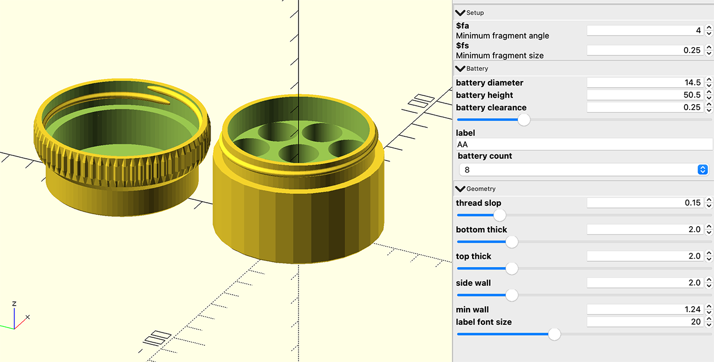
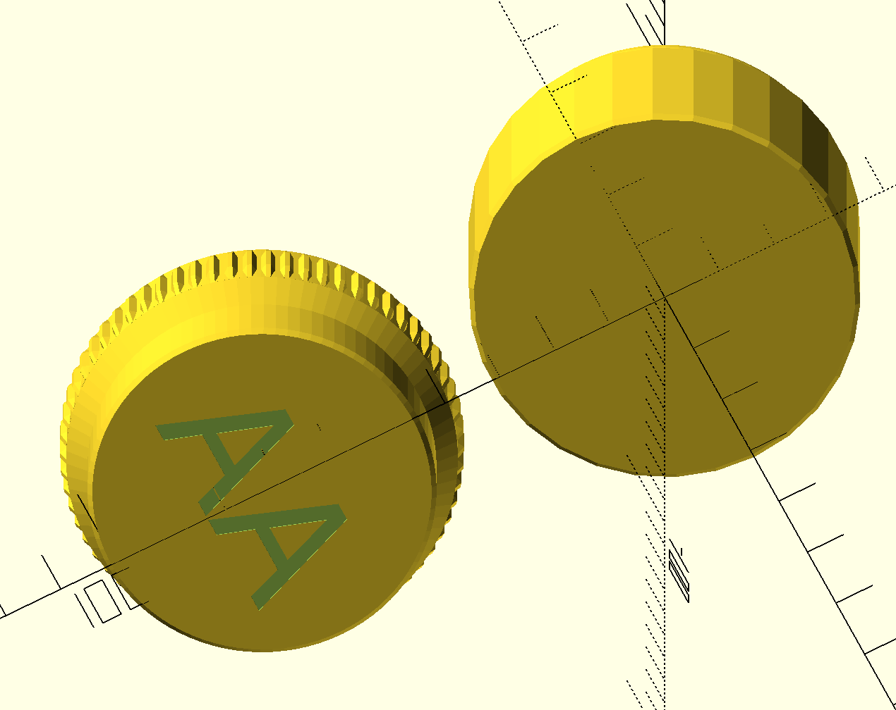

# caddyshack

OpenSCAD models and scripts. Most of my models use the amazing [BOSL2 library](https://github.com/BelfrySCAD/BOSL2).

## Battery Holders

`bh_screw_top_01.scad` - A screw top battery holder that can be configured for either 8 or 16 AA or AAA batteries.

Includes AA or AAA label on the top of the lid

